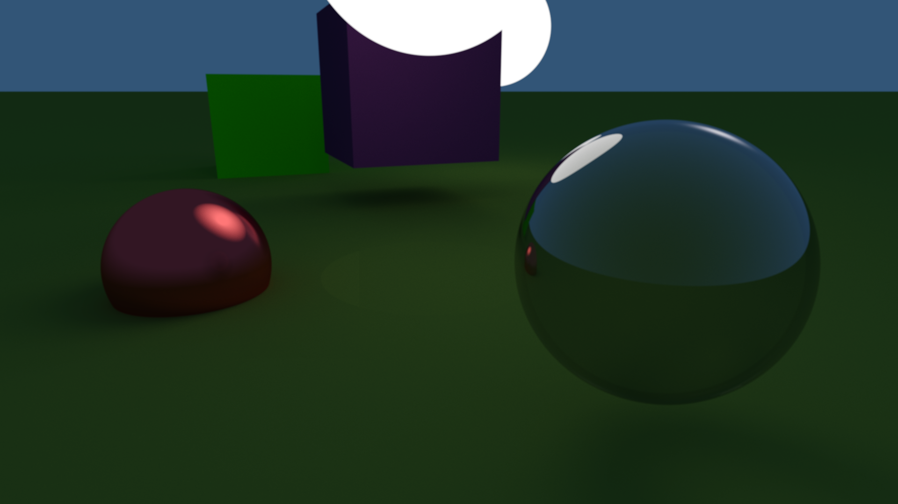

# Path-tracing

This is a project for the implementation of a type of computer graphics - path tracing.
The program has a camera object that controls POV, and primitives directly with which you can build a scene.

Inspired by [@ArtemOnigiri](https://github.com/ArtemOnigiri), from this [video](https://www.youtube.com/watch?v=jKjbeWHujV0)

# Suported primitives 📐

```c++
int object_type;
/*
0. sphere
1. box
2. plane
*/
```

# Suported materials 🏀
```c++
int type;
/*
0. default
1. lamp
*/
vec3 color;
float Roughness;  // shows how randomness will be next ray direction reflected or refract
float Specular;   // shows how likely ray will reflect, instead of refract (affects only if Refraction != 1)
float Refraction; // refraction property of object
```

# Movement ⌨️
- ``` W,A,S,D LShift, SPACE``` - move camera
- ``` 1 ```, ``` 2 ``` - increase/decrease aperture
- ``` Sroll Up/Down ``` - increase/decrease focal length
- ``` R ``` - start render
- 
- ``` I ``` - enable/disable information output
- ``` Z ``` - simplify image quality
- ``` ESC ``` - detach program
- ``` ENTER ``` - enable fullscreen (works only if your window size is 1920x1080)

# Settings option ⚙️
```c++
int w = 1920, h = 1080,
		viewport_samples = 1, render_samples = 4096,
    max_samples_per_frame = 256, // responsible for how many samples at a time gpu will render
    max_claster_size = 256, // responsible for what area of a screen at a time gpu will render
    sun_size = 8, max_reflect = 32;
	double sensetivity = 0.5, camera_speed = 0.3, focal_length = 1, aperture = 620, camera_size = 1;
	Vector3f light_dir(0.5, 0.75, -0.35),
		camera_origin(-30, 0, 7.5), camera_rotation(0, -8, 0); //input in degrees
	string render_path = "D:/AInstall/render/"; // it is important to establish an existing path 0_0
```

**IMPORTANT** ⚠️

If the number is set too high for ```max_samples_per_frame``` or ```max_claster_size```, rendering of one frame takes too long and the program crashes by the driver/OS. Therefore, if the program stops working, try reducing these numbers.

---

# [Callery](./render/)


